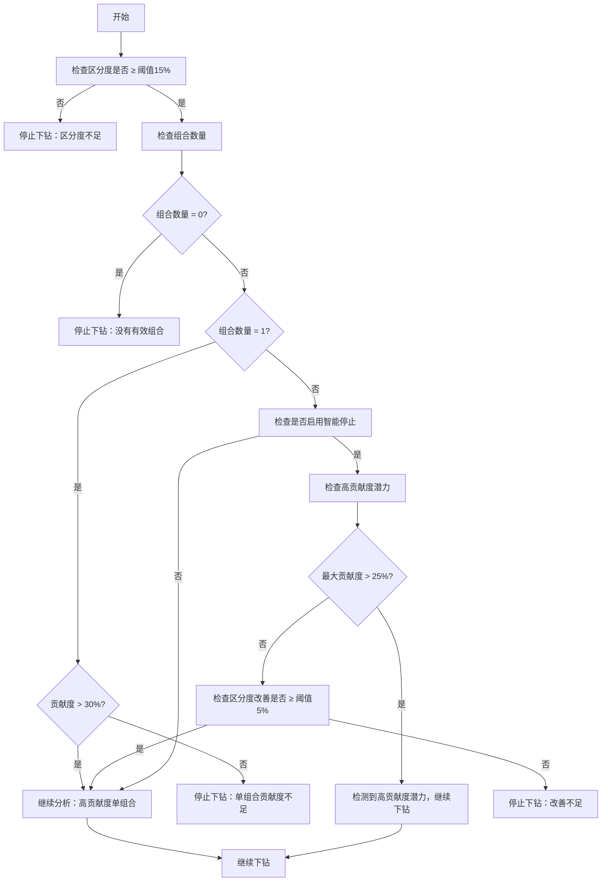

# 增强版贡献度分析算法设计

## 算法概述

增强版贡献度分析算法是一个基于区分度的智能下钻分析系统，旨在自动识别最具业务价值的维度组合层级，并生成有意义的业务洞察。

## 核心算法

### 1. 区分度计算算法

#### 算法原理
区分度（Discrimination）衡量不同维度组合在贡献度上的差异程度。高区分度表示存在明显的主导因素，低区分度表示贡献相对均匀。

#### 改进的区分度计算方法

**多组合情况的计算公式：**
```
区分度 = 变异系数权重 × 变异系数 + 极差权重 × 极差 + 最大值权重 × 最大值权重
其中：
- 变异系数权重 = 50%
- 极差权重 = 30%
- 最大值权重 = 20%
- 变异系数 = (标准差 / 均值) × 100%
- 极差 = max(|贡献度|) - min(|贡献度|)
- 最大值权重 = max(|贡献度|) / 100（归一化到0-1范围）
```

**单组合情况的特殊处理：**
为了正确识别高贡献度的主导因子，算法对单组合情况采用特殊的区分度计算方法：

- **高贡献度组合（>30%）**：基础分80分 + 贡献度加权（0.5倍）
- **中等贡献度组合（>15%）**：基础分60分 + 贡献度加权（0.8倍）
- **低贡献度组合（≤15%）**：贡献度的2倍作为区分度

这种设计确保了即使只有一个组合，如果其贡献度很高（如47%），也能获得相应的高区分度（约103.5分），从而被算法正确识别为重要的分析结果。

#### 算法改进的核心优势

1. **变异系数引入**：更好地反映相对差异程度，避免受绝对数值大小影响
2. **绝对值处理**：正确处理负贡献度，确保计算的准确性
3. **单组合优化**：解决了原算法对单组合直接返回0的问题
4. **主导因子识别**：高贡献度的主导因子能够被正确识别和优先选择

#### 权重设计理由
- **变异系数权重50%**：反映相对差异程度，更加稳定和可比较
- **极差权重30%**：突出最大差异，识别极端情况
- **最大值权重20%**：突出主导因子的重要性，确保高贡献度组合得到重视

### 2. 智能下钻决策算法

#### 改进的决策流程图


#### 优化的停止条件

**基础停止条件：**
1. **区分度阈值**：当前层级区分度 < 15%
2. **最大层级**：达到最大下钻层级限制

**改进的组合数量判断：**
- **无组合**：立即停止分析
- **单组合且高贡献度（>30%）**：继续分析，让其参与最优层级选择
- **单组合且低贡献度（≤30%）**：停止分析
- **多组合**：继续分析

**智能停止条件优化：**
当启用智能停止且为多组合情况时，算法会检查当前层级是否具有高贡献度潜力：
- **高贡献度潜力判断**：当前层级最大贡献度 > 25%
- **潜力存在时**：忽略区分度改善阈值，继续下钻以寻找更高贡献度的组合
- **潜力不足时**：按原有逻辑检查区分度改善是否 ≥ 5%

#### 算法改进的核心优势

1. **高贡献度单组合保护**：避免因组合数量不足而错过重要的主导因子
2. **智能判断机制**：根据贡献度大小决定是否继续分析单组合
3. **高贡献度潜力检测**：当检测到可能存在更高贡献度组合时，继续下钻而不是提前停止
4. **业务价值导向**：优先保留对业务有重要意义的高贡献度组合

这种改进确保了算法能够发现所有层级的高贡献度组合，特别是像47%贡献度的交通银行+欧元+专用户这样的主导组合，不会因为中间层级的区分度改善不足而被错过。

### 3. 最优层级选择算法

#### 改进的评分机制

**最明细层级优先策略：**
算法首先检查最明细层级（通常是最后一个层级）是否包含高贡献度的主导因子。如果满足以下条件，直接选择最明细层级：
- 最大贡献度 > 30%
- 区分度 > 60分

这种设计确保了像47%贡献度的交通银行+欧元+专用户组合这样的主导因子能够被优先识别和选择。

**多维度组合优先策略：**
为了确保返回包含完整维度信息的分析结果，算法对多维度组合给予显著的优先权：

多维度组合评分计算过程：
1. **基础分数**：使用层级的区分度作为基础分数
2. **多维度加权**：维度数量 ≥ 2 的层级获得 1.5 倍加权
3. **组合数量优化**：3-15 个组合的层级获得 1.2 倍加权
4. **最明细层级加权**：最明细层级且最大贡献度 > 20% 时获得 1.1 倍加权
5. **多维度高贡献度加权**：多维度且最大贡献度 > 10% 时获得额外 1.2 倍加权

**综合评分机制：**
当最明细层级不满足优先条件时，使用改进的综合评分机制：

最终评分计算公式：
```
最终评分 = 区分度 × 多维度权重 × 组合数量权重 × 层级权重 × 高贡献度权重

其中：
- 多维度权重 = 1.5（维度数 ≥ 2）或 1.0（维度数 = 1）
- 组合数量权重 = 1.2（3 ≤ 组合数 ≤ 15）或 0.9（组合数 > 15）或 1.0（其他）
- 层级权重 = 1.1（最明细层级且最大贡献度 > 20%）或 1.0（其他）
- 高贡献度权重 = 1.2（多维度且最大贡献度 > 10%）或 1.0（其他）
```

#### 算法改进的核心优势

1. **主导因子优先识别**：高贡献度的主导因子能够被直接识别，无需复杂的评分比较
2. **多维度信息完整性**：优先选择包含多个维度信息的层级，提供更完整的业务洞察
3. **最明细层级偏好**：在同等条件下，优先选择更详细的分析层级
4. **业务价值导向**：确保对业务最有价值的分析结果被优先展示
5. **智能平衡机制**：在主导因子不明显时，仍能通过综合评分选择最佳层级

#### 权重设计理由

- **多维度优先（1.5倍权重）**：多维度组合提供更完整的业务洞察，如"交通银行欧元专用户"比"交通银行"更有价值
- **最明细层级优先**：业务分析通常需要最详细的洞察
- **高贡献度阈值（30%）**：确保只有真正的主导因子才触发优先选择
- **区分度阈值（60分）**：保证选择的层级具有足够的分析价值
- **3-15个组合最优**：适合业务理解和决策制定，避免信息过载
- **多维度高贡献度加权**：鼓励选择既有多维度信息又有业务价值的层级

这种改进确保了算法能够优先选择包含完整维度信息的多维度组合，从而返回如"交通银行欧元专用户增长贡献最显著"这样的完整业务洞察，而不是仅仅返回"交通银行增长贡献最显著"。

### 4. 维度优先级排序算法

#### 算法原理
通过计算每个维度的单独贡献度方差，确定维度的重要性排序。方差越大，表示该维度的区分能力越强。

#### 计算步骤
1. **提取单维度组合**：从所有维度组合中筛选出每个维度的单独组合数据
2. **计算贡献度方差**：对每个维度的所有值计算贡献度方差，衡量该维度内部的差异程度
3. **排序确定优先级**：按方差从大到小排列维度，方差越大的维度优先级越高

#### 算法逻辑
算法首先遍历所有可用维度，对每个维度收集其单独的贡献度数据。然后计算这些贡献度值的统计方差，方差反映了该维度内不同值之间的差异程度。最后将所有维度按照方差大小降序排列，形成维度优先级顺序。

这种方法能够有效识别出对业务变化影响最大的关键维度，为后续的多维度组合分析提供指导。

## 数据质量算法

### 1. 完整性检查算法

#### 检查指标
- **有效组合比例**：有效组合数 / 总组合数
- **阈值**：80%

#### 实现逻辑
算法遍历所有维度组合，检查每个组合是否包含有效的维度值和非零的绝对值。统计有效组合的数量，计算有效组合占总组合数的比例。如果这个比例低于80%的阈值，则认为数据完整性不足，会降低数据质量评分并记录相应的问题描述。

### 2. 维度分布均衡性检查

#### 检查指标
- **变异系数**：标准差 / 平均值 × 100%
- **阈值**：50%

#### 计算公式
```
变异系数 = (√(Σ(xi - μ)² / n) / μ) × 100%
其中：
- xi = 各维度的组合数量
- μ = 平均组合数量
- n = 维度数量
```

### 3. 异常值检测算法

#### 检测方法
使用简化的异常值检测：均值 ± 2倍标准差

#### 实现逻辑
异常值检测算法首先检查数据量是否足够（至少4个值），然后计算所有值的均值和标准差。使用"均值±2倍标准差"作为异常值判断标准，超出这个范围的值被认为是异常值。这种方法简单有效，能够识别出明显偏离正常范围的数据点，帮助提高分析结果的可靠性。

## 业务洞察生成算法

### 1. 洞察模板系统

#### 模板类型
1. **主要贡献者模板**
2. **多维度组合模板**
3. **对比分析模板**
4. **分析层级模板**
5. **业务建议模板**

#### 模板示例
算法根据分析结果的特点选择合适的模板。对于多维度组合，会生成类似"最显著的变化来自某某与某某的组合，贡献度达到某某百分比"的洞察。对于单维度情况，会生成"某某维度中的某某表现最为突出，贡献度为某某百分比"的描述。这种模板化的方法确保了生成的业务洞察既准确又易于理解。

### 2. 业务语言转换规则

#### 转换策略
1. **技术术语 → 业务术语**
   - "DIM01_GN01" → "交通银行"
   - "组合贡献度" → "增长贡献"

2. **数值表达优化**
   - "47.23%" → "约47%"
   - "负向贡献" → "减少影响"

3. **关联性描述**
   - "与...组合" → "在...条件下"
   - "显著性" → "突出表现"

## 性能优化算法

### 1. 早期停止机制

#### 优化策略
- **区分度预检查**：快速评估是否值得继续分析
- **组合数量限制**：避免处理过多无意义组合
- **内存预分配**：减少动态内存分配开销

### 2. 数据结构优化

#### 优化措施
- **切片预分配**：根据预期大小预分配切片容量
- **映射复用**：重用临时映射结构
- **指针传递**：避免大结构体的值拷贝

```go
// 预分配示例
combinations := make([]*DimensionCombination, 0, expectedSize)
dimensionMap := make(map[string]float64, len(dimensions))
```

## 算法参数调优

### 1. 区分度阈值调优

#### 调优原则
- **业务复杂度**：复杂业务降低阈值（10-12%）
- **数据质量**：高质量数据提高阈值（18-20%）
- **分析目标**：探索性分析降低阈值，决策性分析提高阈值

#### 推荐配置
根据不同的分析需求，建议采用不同的区分度阈值配置：
- **探索性分析**：使用较低的阈值（10.0），以发现更多潜在的模式
- **标准分析**：使用中等阈值（15.0），平衡发现能力和分析质量
- **决策性分析**：使用较高阈值（20.0），确保只关注最显著的差异

### 2. 组合数量阈值调优

#### 调优考虑
- **用户认知负荷**：一般不超过7±2个组合
- **业务复杂度**：复杂业务可适当增加
- **展示方式**：图表展示可支持更多组合

### 3. 智能停止参数调优

#### 改善阈值设置
- **保守策略**：3-5%（避免过早停止）
- **标准策略**：5-8%（平衡效率和质量）
- **激进策略**：8-12%（快速收敛）

## 算法验证

### 1. 单元测试覆盖

#### 测试用例
- **边界条件**：空数据、单一组合、极值数据
- **正常情况**：标准业务场景
- **异常情况**：数据质量问题、配置错误

### 2. 性能基准测试

#### 基准指标
- **处理时间**：不同数据规模下的处理时间
- **内存使用**：峰值内存占用
- **准确性**：与人工分析结果的一致性

### 3. A/B测试框架

#### 对比维度
- **分析质量**：业务洞察的准确性和有用性
- **用户满意度**：用户对结果的接受程度
- **处理效率**：分析速度和资源消耗

## 算法扩展性

### 1. 自定义区分度算法

#### 扩展接口
系统提供了区分度计算器的接口，允许用户注入自定义的区分度计算算法。接口定义了计算方法，接受贡献度数组作为输入，返回计算得出的区分度值。分析器提供了设置自定义计算器的方法，使得系统能够根据不同的业务需求采用不同的区分度计算策略。

### 2. 多指标支持

#### 扩展方向
- **加权区分度**：不同指标使用不同权重
- **复合指标**：同时考虑多个业务指标
- **动态权重**：根据业务场景自动调整权重

### 3. 机器学习集成

#### 集成方案
- **参数自动调优**：基于历史数据优化参数
- **模式识别**：识别常见的业务模式
- **预测分析**：预测未来的贡献度变化趋势