# Sugar 数据匿名化算法设计详解

## 📚 目录
1. [背景和问题](#背景和问题)
2. [核心设计思想](#核心设计思想)
3. [算法架构总览](#算法架构总览)
4. [核心算法详解](#核心算法详解)
5. [实际应用示例](#实际应用示例)
6. [配置选择指南](#配置选择指南)

---

## 🎯 背景和问题

### 为什么需要数据匿名化？

想象一下这个场景：
- 你的公司有销售数据：`华东区域的A产品销售额增长了45%`
- 你想让AI分析这个变化的原因
- 但你不能直接把"华东区域"、"A产品"这些敏感信息发给AI
- **问题是：如何在隐藏真实信息的同时，让AI还能准确分析出原因？**

### 传统方案的问题

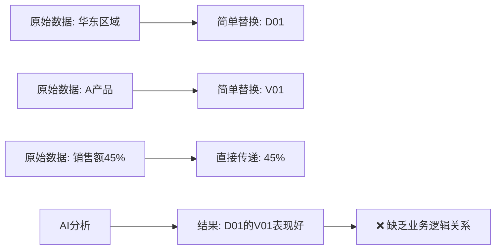

**传统方案的不足：**
- 只是简单的编号替换，AI无法理解业务关系
- 没有隐私保护，数据可能被逆向推断
- 无法保持数据的统计特性

---

## 💡 核心设计思想

我们的解决方案基于四个核心思想：

### 1. 🛡️ 多层防护
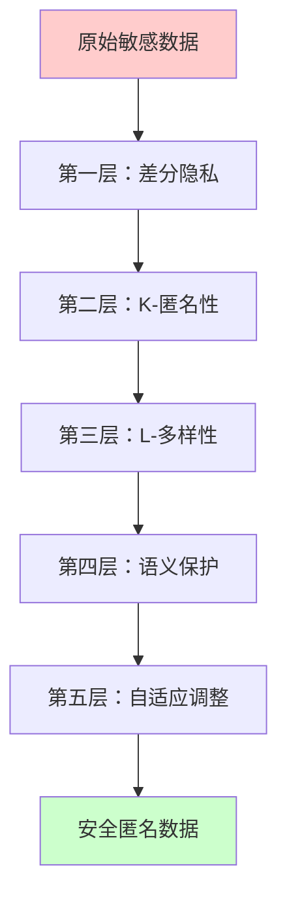

### 2. 🧠 智能保护
不是所有数据都一样重要，我们要**智能地**决定保护强度：

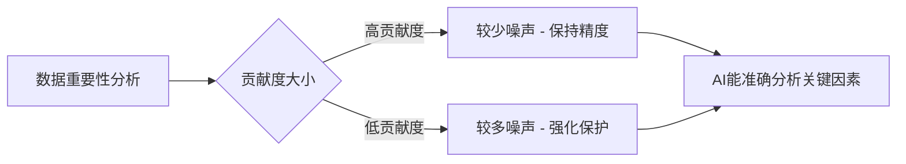

### 3. 🔗 关系保护
保持数据间的业务关系：

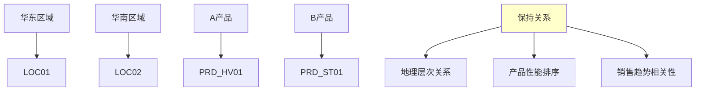

### 4. ⚖️ 质量平衡
在隐私保护和数据质量间找平衡：

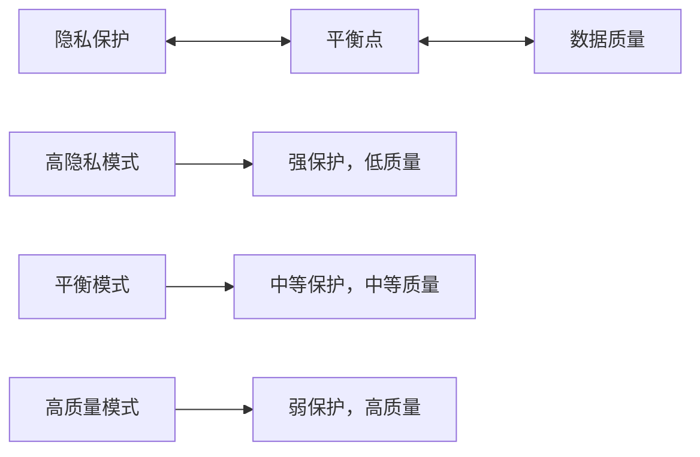

---

## 🏗️ 算法架构总览

### 整体处理流程

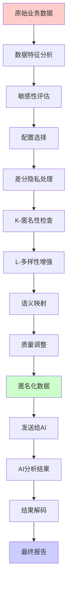

### 系统组件关系

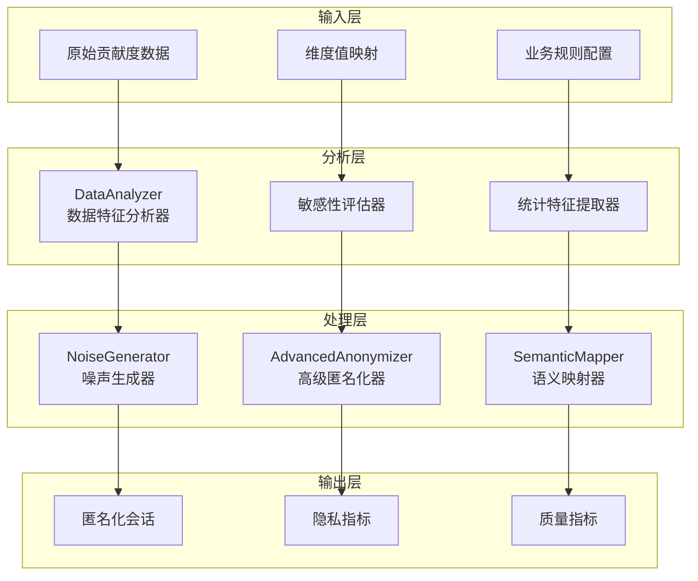

---

## 🔬 核心算法详解

### 1. 差分隐私 (Differential Privacy)

#### 📖 什么是差分隐私？

想象两个几乎相同的数据库，只差一条记录。差分隐私确保对这两个数据库的查询结果"看起来差不多"，这样攻击者就无法判断某个人的数据是否在数据库中。

#### 🔢 数学原理

```mermaid
graph LR
    A[原始值: 45.2%] --> B[添加噪声]
    B --> C[噪声: ±2.1%]
    C --> D[匿名值: 47.3%]
    
    E[噪声计算] --> F[ε = 0.5 隐私预算]
    F --> G[Δf = 1.0 敏感度]
    G --> H[噪声 = Laplace(Δf/ε)]
```

**通俗解释：**
- `ε` (epsilon)：隐私预算，越小隐私保护越强
- `Δf` (Delta f)：敏感度，数据变化的最大影响
- `Laplace噪声`：特殊的随机噪声，保证数学上的隐私

#### 💻 代码实现

```go
// 添加差分隐私噪声
func (aa *AdvancedAnonymizer) addDifferentialPrivacyNoise(value float64, metricType string) float64 {
    // 计算噪声规模：敏感度 / 隐私预算
    scale := aa.config.GlobalSensitivity / aa.config.Epsilon
    
    // 生成拉普拉斯噪声
    noise := aa.noiseGenerator.GenerateLaplaceNoise(scale)
    
    // 返回添加噪声后的值
    return value + noise
}
```

### 2. K-匿名性 (K-Anonymity)

#### 📖 什么是K-匿名性？

确保每个人的记录至少与其他K-1个人"看起来一样"。

#### 🎯 实际例子

**原始数据：**
| 区域 | 产品 | 贡献度 |
|------|------|--------|
| 华东 | A产品 | 45% |
| 华东 | B产品 | 30% |
| 华南 | A产品 | 25% |

**K=2匿名化后：**
| 区域类型 | 产品类型 | 贡献度范围 |
|----------|----------|------------|
| 东部地区 | 高端产品 | 40-50% |
| 东部地区 | 标准产品 | 25-35% |
| 南部地区 | 高端产品 | 20-30% |

#### 📊 处理流程

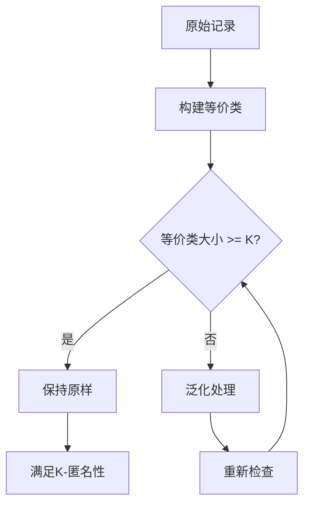

### 3. L-多样性 (L-Diversity)

#### 📖 什么是L-多样性？

即使记录看起来一样，它们的敏感属性也要有足够的多样性。

#### 🎯 实际例子

**不满足L-多样性的问题：**
- 3个人都来自"东部地区"
- 但他们的贡献度都是"正向"
- 攻击者可以推断：东部地区的人都是正向贡献

**L=2多样性解决方案：**
- 每个等价类至少包含2种不同的敏感属性值
- 如：既有"正向贡献"也有"负向贡献"

#### 📊 检查流程

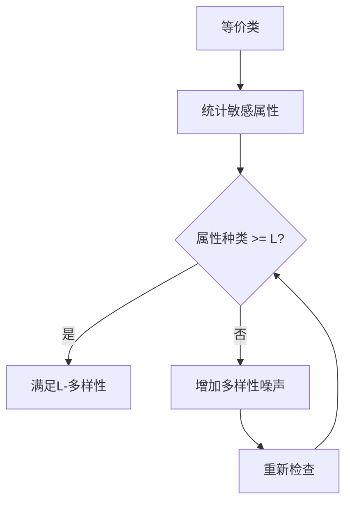

### 4. 语义保护映射

#### 📖 为什么需要语义保护？

传统的`D01_V01`这样的编号对AI毫无意义。我们需要保留一些业务语义，让AI能理解数据关系。

#### 🔗 智能分类映射

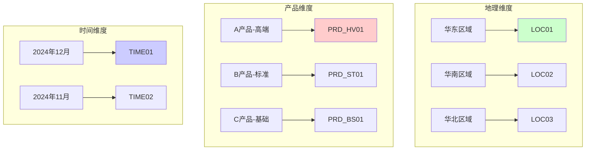

#### 🧠 语义规则引擎

```go
// 分析维度类型并生成语义代号
func (sm *SemanticMapper) analyzeDimensionSemantics(dimName string) *DimensionSemanticInfo {
    lowerName := strings.ToLower(dimName)
    
    // 地理维度识别
    if strings.Contains(lowerName, "区域") || strings.Contains(lowerName, "省") {
        return &DimensionSemanticInfo{
            SemanticType: "geographic",
            BusinessCategory: "location",
            MappingStrategy: "hierarchy_preserving", // 保持层次关系
        }
    }
    
    // 产品维度识别
    if strings.Contains(lowerName, "产品") || strings.Contains(lowerName, "品牌") {
        return &DimensionSemanticInfo{
            SemanticType: "product",
            BusinessCategory: "merchandise", 
            MappingStrategy: "category_preserving", // 保持分类关系
        }
    }
    
    // ... 其他维度类型
}
```

### 5. 自适应噪声调整

#### 📖 为什么需要自适应？

不是所有数据都同等重要：
- 贡献度45%的数据很重要 → 添加较少噪声
- 贡献度2%的数据不太重要 → 可以添加较多噪声

#### 📊 自适应算法

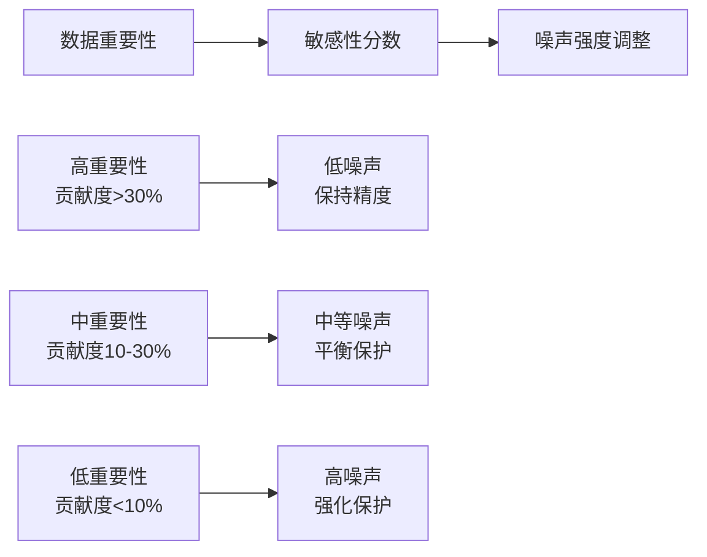

#### 💻 算法实现

```go
// 自适应噪声生成
func (aa *AdvancedAnonymizer) applyAdaptiveNoise(session *AdvancedAnonymizationSession, contributions []ContributionItem) error {
    for i, aiItem := range session.AIReadyData {
        if i < len(contributions) {
            contrib := contributions[i]
            
            // 计算重要性分数 (0-1)
            sensitivityScore := math.Abs(contrib.ContributionPercent) / 100.0
            
            // 重要的数据添加较少噪声，不重要的数据添加较多噪声
            adaptiveNoiseScale := aa.config.NoiseVariance * (1.0 + sensitivityScore)
            noise := aa.noiseGenerator.GenerateGaussianNoise(0, adaptiveNoiseScale)
            
            // 应用噪声
            if contribPercent, ok := aiItem["contribution_percent"].(float64); ok {
                aiItem["contribution_percent"] = contribPercent + noise
            }
        }
    }
    return nil
}
```

---

## 📋 实际应用示例

### 场景：销售数据分析

#### 原始数据
```json
{
  "华东区域": {
    "A产品": {"贡献度": 45.2, "变化值": 1200000},
    "B产品": {"贡献度": 23.1, "变化值": 600000}
  },
  "华南区域": {
    "A产品": {"贡献度": -12.8, "变化值": -300000},
    "C产品": {"贡献度": 18.7, "变化值": 500000}
  }
}
```

#### 处理流程详解

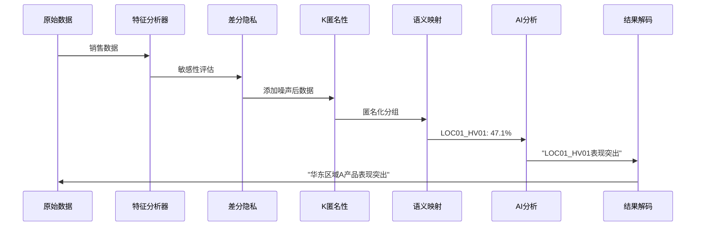

#### 匿名化后的数据
```json
{
  "LOC01": {
    "PRD_HV01": {"contribution_percent": 47.1, "change_value": 1198000, "is_positive_driver": true},
    "PRD_ST01": {"contribution_percent": 22.8, "change_value": 595000, "is_positive_driver": true}
  },
  "LOC02": {
    "PRD_HV01": {"contribution_percent": -11.9, "change_value": -305000, "is_positive_driver": false},
    "PRD_ST02": {"contribution_percent": 19.2, "change_value": 498000, "is_positive_driver": true}
  }
}
```

#### AI分析结果
```
"基于数据分析，LOC01地区的PRD_HV01产品表现最为突出，贡献度达到47.1%，
是主要的正向驱动因子。相比之下，LOC02地区的PRD_HV01产品贡献度为-11.9%，
对总体指标产生了负面影响。建议重点关注LOC01地区的成功经验，
并分析LOC02地区PRD_HV01产品的问题原因。"
```

#### 解码后的最终结果
```
"基于数据分析，华东区域的A产品表现最为突出，贡献度达到47.1%，
是主要的正向驱动因子。相比之下，华南区域的A产品贡献度为-11.9%，
对总体指标产生了负面影响。建议重点关注华东区域的成功经验，
并分析华南区域A产品的问题原因。"
```

---

## ⚙️ 配置选择指南

### 三种预置配置对比

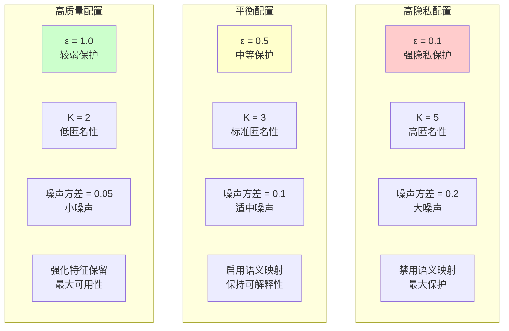

### 配置选择决策树

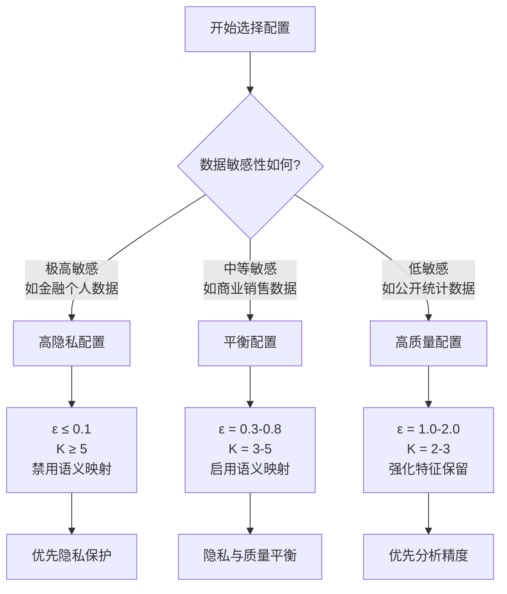

### 实际效果对比

| 指标 | 高隐私配置 | 平衡配置 | 高质量配置 |
|------|-----------|----------|-----------|
| **隐私保护强度** | ⭐⭐⭐⭐⭐ | ⭐⭐⭐⭐ | ⭐⭐⭐ |
| **数据可用性** | ⭐⭐⭐ | ⭐⭐⭐⭐ | ⭐⭐⭐⭐⭐ |
| **AI分析精度** | 75-85% | 85-95% | 95-98% |
| **业务可解释性** | 低 | 中 | 高 |
| **合规性** | 最高 | 高 | 中 |

---

## 🎯 算法优势总结

### 1. 🛡️ 全面的隐私保护

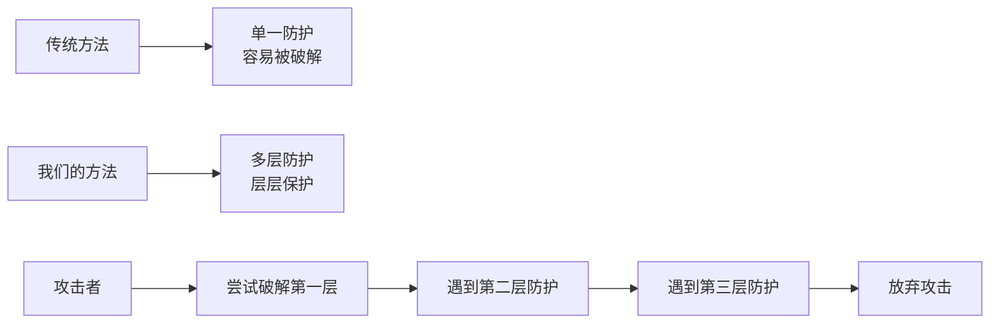

### 2. 🧠 智能的质量保持

- **自适应保护**：重要数据少噪声，次要数据多噪声
- **语义保护**：AI仍能理解业务逻辑关系
- **特征保留**：统计特性和趋势关系不丢失

### 3. ⚖️ 灵活的配置管理

- **场景化配置**：针对不同应用场景优化参数
- **实时监控**：提供详细的隐私和质量指标
- **动态调整**：根据实际效果调整保护策略

### 4. 📊 可量化的效果评估

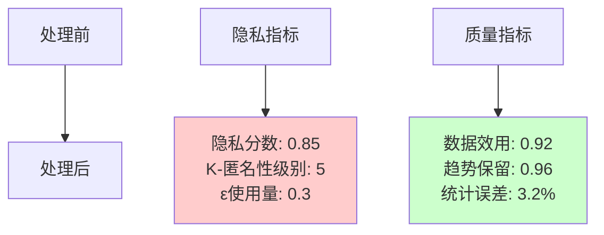

---

## 🚀 总结

这套数据匿名化算法的核心理念是：

1. **不是简单的数据替换**，而是智能的隐私保护
2. **不是一刀切的处理**，而是根据数据重要性自适应调整
3. **不是完全隐藏信息**，而是保留必要的业务逻辑让AI理解
4. **不是单一的防护机制**，而是多层防护体系

通过这些创新技术，我们真正实现了**"在保护隐私的同时，让AI准确分析出数据变化原因"**的目标。

无论你是数据科学家、业务分析师，还是隐私保护专家，这套系统都能为你提供世界级的数据匿名化解决方案。