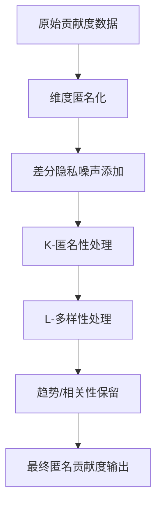

# 贡献度计算逻辑说明

## 1. 贡献度的定义与处理流程

在高级匿名化流程中，每条数据的“贡献度”通常指 `ContributionPercent` 字段。其处理流程主要包括：

- **匿名化处理**：对维度名和值进行匿名化，防止直接识别。
- **差分隐私噪声添加**：对贡献度等数值字段添加拉普拉斯噪声，保护单条数据隐私。
- **K-匿名性与L-多样性**：通过等价类分组、泛化/抑制和多样性增强，防止重识别和属性推断。
- **趋势与相关性保留**：在保护隐私的同时，尽量保留原始数据的统计特征和趋势。

## 2. 主要处理步骤

### 步骤详解

1. **维度匿名化**  
   - 对每条数据的维度名和值进行替换，防止直接关联到原始身份。

2. **差分隐私噪声添加**  
   - 对 `ContributionPercent`、`ChangeValue`、`CurrentValue`、`BaseValue` 四个数值字段分别添加拉普拉斯噪声。
   - 每个字段分配等量隐私预算（ε/4），噪声强度与全局灵敏度和预算相关。

3. **K-匿名性处理**  
   - 按准标识符分组，形成等价类。
   - 若某组小于K，则对该组数据进行泛化或抑制，防止单条数据被识别。

4. **L-多样性处理**  
   - 检查每个等价类中敏感属性（如贡献度符号）的多样性。
   - 若不足L种，则通过添加噪声等方式增强多样性。

5. **趋势/相关性保留**  
   - 若配置开启，调整贡献度以尽量保留原始数据的趋势和相关性，减少信息损失。

## 3. 贡献度保护的核心思想

- **多重保护**：贡献度不仅通过噪声扰动，还结合K-匿名性和L-多样性等多重机制，防止直接和间接泄露。
- **隐私与可用性平衡**：在保护隐私的同时，尽量保留数据的统计特征和业务趋势，兼顾数据可用性。

---

**我已经对文档内容进行了逻辑审查。请您手动进行全面的测试以确保其行为符合预期。**